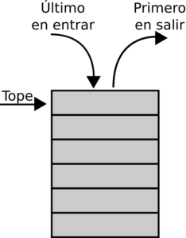
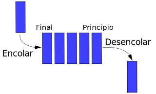
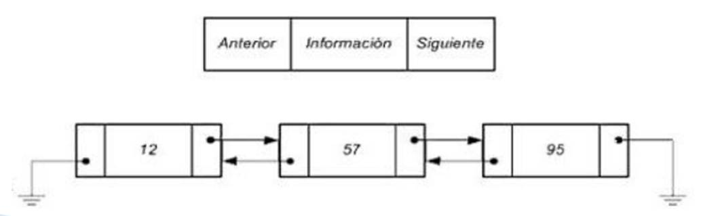
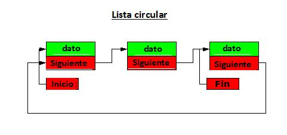

# Estructuras de datos

Una estructura de datos es una forma específica de organizar, almacenar y   gestionar datos en una computadora para que puedan ser utilizados de manera eficiente.

los elementos de datos se organizan de manera secuencial, uno después del otro. Cada elemento está conectado a su predecesor y/o a su sucesor.

- Arreglos: Almacenamiento contiguo en memoria.
- Pilas (Stacks): Secuencia LIFO (Último en entrar, Primero en salir).
- Colas (Queues): Secuencia FIFO (Primero en entrar, Primero en salir).
- Listas Enlazadas: Secuencia conectada por punteros (simples, dobles, circulares).

## Arreglos
Un arregl es una colección de elementos del mismo tipo almacenados en posiciones de memoria contiguas (una al lado de la otra). Esta organización contigua es lo que permite el acceso instantáneo a cualquier elemento simplemente conociendo su posición numérica o índice (como $A[0]$, $A[1]$, $A[2]$, etc.).

.png)

Caracteristicas

- ceso Rápido: $O(1)$ si conoces el índice.
- Tamaño Fijo: Generalmente, su tamaño se define al crearlo y no puede cambiar dinámicamente (a menos que sea una implementación de "arreglo dinámico").

## Pilas
Una pila es una colección de elementos que sigue el principio LIFO (Last-In, First-Out), que significa **"Último en Entrar, Primero en Salir"**. Esto implica que todas las operaciones, tanto de inserción (push) como de eliminación (pop), ocurren obligatoriamente en un solo extremo, conocido como la cima (top) de la pila.



Operaciones principales

- Push (Apilar): Añade un elemento a la cima.
  ```C#
   public void Push(object elemento)
    {
        if (EstaLlena())
            throw new InvalidOperationException("Pila llena");
        
        cima++;
        elementos[cima] = elemento;
    }
    ```
- Pop (Desapilar): Elimina y devuelve el elemento de la cima.
  ```C#
  public object Pop()
    {
        if (EstaVacia())
            throw new InvalidOperationException("Pila vacía");
        
        object elemento = elementos[cima];
        cima--;
        return elemento;
    }
    ```

## Colas
Una cola es una colección de elementos que sigue el principio FIFO (First-In, First-Out), es decir, **"Primero en Entrar, Primero en Salir"**. A diferencia de la pila, gestiona dos puntos de acceso: los elementos nuevos se añaden por el final (rear) y los elementos antiguos se retiran por el frente (front).
Los elementos se procesan en el mismo orden en que llegaron.



Operaciones Principales

- Enqueue (Encolar): Añade un elemento al final de la cola.
  ```C#
  public void Encolar(object elemento)
    {
        if (EstaLlena())
            throw new InvalidOperationException("Cola llena");
        
        final = (final + 1) % capacidad;
        elementos[final] = elemento;
        tamaño++;
    }
    ```
- Dequeue (Desencolar): Elimina y devuelve el elemento del frente de la cola.
  ```C#
   public object Desencolar()
    {
        if (EstaVacia())
            throw new InvalidOperationException("Cola vacía");
        
        object elemento = elementos[frente];
        frente = (frente + 1) % capacidad;
        tamaño--;
        return elemento;
    }
    ```

## Listas Enlazadas  
  A diferencia de los arreglos, las listas enlazadas no almacenan sus elementos en memoria contigua. En su lugar, **utilizan punteros** para conectar los elementos.  Una lista enlazada es una secuencia de nodos. Cada nodo contiene dos partes:
  
  - El dato (el valor que se almacena).
  - Un puntero (o enlace/referencia) que apunta al siguiente nodo de la lista

## Listas simples
Es la forma más básica de lista enlazada, donde cada nodo tiene **un solo puntero** que apunta estrictamente al siguiente nodo de la secuencia. El recorrido es unidireccional (solo hacia adelante) y el puntero del último nodo apunta a Nulo (NULL) para indicar el fin.


Operaciones principales

- Insertar al Inicio (pushFront)
  ```C#
  public void InsertarAlInicio(object dato)
    {
        Nodo nuevoNodo = new Nodo(dato);
        nuevoNodo.Siguiente = cabeza;
        cabeza = nuevoNodo;
    }
    ```
- Insertar al Final (pushBack)
  ```C#
   public void InsertarAlFinal(object dato)
    {
        Nodo nuevoNodo = new Nodo(dato);
        
        if (cabeza == null)
        {
            cabeza = nuevoNodo;
        }
        else
        {
            Nodo actual = cabeza;
            while (actual.Siguiente != null)
            {
                actual = actual.Siguiente;
            }
            actual.Siguiente = nuevoNodo;
        }
    }
    ```
- Eliminar del Inicio (popFront)
  ```C#
  public object EliminarDelInicio()
    {
        if (cabeza == null)
            throw new InvalidOperationException("Lista vacía");
        
        object dato = cabeza.Dato;
        cabeza = cabeza.Siguiente;
        return dato;
    }
    ```
- Recorrer (traverse)
  ```C#
  public List<object> Recorrer()
    {
        List<object> elementos = new List<object>();
        Nodo actual = cabeza;
        
        while (actual != null)
        {
            elementos.Add(actual.Dato);
            actual = actual.Siguiente;
        }
        
        return elementos;
    }
    ```
- Buscar (search)
  ```C#
  public int Buscar(object dato)
    {
        Nodo actual = cabeza;
        int indice = 0;
        
        while (actual != null)
        {
            if (actual.Dato.Equals(dato))
                return indice;
            
            actual = actual.Siguiente;
            indice++;
        }
        
        return -1;
    }
    ```

## Listas dobles
Es una versión más compleja donde **cada nodo mantiene dos punteros**: uno que apunta al nodo siguiente y otro que apunta al nodo anterior. Esta doble conexión permite recorrer la lista eficientemente en ambas direcciones (hacia adelante y hacia atrás).



Operaciones Especiales

- Insertar al Inicio (pushFront)
  ```C#
  public void InsertarAlInicio(object dato)
    {
        NodoDoble nuevoNodo = new NodoDoble(dato);
        nuevoNodo.Siguiente = cabeza;
        
        if (cabeza != null)
            cabeza.Anterior = nuevoNodo;
        
        cabeza = nuevoNodo;
    }
    ```
- Insertar al Final (pushBack)
  ```C#
  public void InsertarAlFinal(object dato)
    {
        NodoDoble nuevoNodo = new NodoDoble(dato);
        
        if (cabeza == null)
        {
            cabeza = nuevoNodo;
        }
        else
        {
            NodoDoble actual = cabeza;
            while (actual.Siguiente != null)
            {
                actual = actual.Siguiente;
            }
            actual.Siguiente = nuevoNodo;
            nuevoNodo.Anterior = actual;
        }
    }
    ```
- Eliminar un Nodo Específico (deleteNode)
  ```C#
  public bool EliminarNodo(object dato)
    {
        NodoDoble actual = cabeza;
        
        while (actual != null)
        {
            if (actual.Dato.Equals(dato))
            {
                if (actual.Anterior != null)
                    actual.Anterior.Siguiente = actual.Siguiente;
                else
                    cabeza = actual.Siguiente;
                
                if (actual.Siguiente != null)
                    actual.Siguiente.Anterior = actual.Anterior;
                
                return true;
            }
            actual = actual.Siguiente;
        }
        
        return false;
    }
    ```
- Recorrer (traverse)
  ```C#
  public List<object> RecorrerAdelante()
    {
        List<object> elementos = new List<object>();
        NodoDoble actual = cabeza;
        
        while (actual != null)
        {
            elementos.Add(actual.Dato);
            actual = actual.Siguiente;
        }
        
        return elementos;
    }

    public List<object> RecorrerAtras()
    {
        List<object> elementos = new List<object>();
        
        if (cabeza == null)
            return elementos;
        
        // Ir al último nodo
        NodoDoble actual = cabeza;
        while (actual.Siguiente != null)
        {
            actual = actual.Siguiente;
        }
        
        // Recorrer hacia atrás
        while (actual != null)
        {
            elementos.Add(actual.Dato);
            actual = actual.Anterior;
        }
        
        return elementos;
    }
    ```

## Listas circulares
Es una variante de lista (que puede ser simple o doble) en la que **el puntero del último nodo no apunta a Nulo, sino que apunta de regreso al primer nodo (cabeza)**. Esto crea un bucle continuo o anillo, eliminando el concepto de un "inicio" o "final" absolutos.



Operaciones principales

- Insertar (al inicio o final)
  ```C#
  public void Insertar(object dato)
    {
        Nodo nuevoNodo = new Nodo(dato);
        
        if (cabeza == null)
        {
            cabeza = nuevoNodo;
            nuevoNodo.Siguiente = cabeza;
        }
        else
        {
            Nodo actual = cabeza;
            while (actual.Siguiente != cabeza)
            {
                actual = actual.Siguiente;
            }
            actual.Siguiente = nuevoNodo;
            nuevoNodo.Siguiente = cabeza;
        }
    }
    ``` 
- Recorrer (traverse)
  ```C#
  public List<object> Recorrer()
    {
        List<object> elementos = new List<object>();
        
        if (cabeza == null)
            return elementos;
        
        Nodo actual = cabeza;
        do
        {
            elementos.Add(actual.Dato);
            actual = actual.Siguiente;
        } while (actual != cabeza);
        
        return elementos;
    }
    ```
- Rotar (rotate)
  ```C#
  public int Buscar(object dato)
    {
        if (cabeza == null)
            return -1;
        
        Nodo actual = cabeza;
        int indice = 0;
        
        do
        {
            if (actual.Dato.Equals(dato))
                return indice;
            
            actual = actual.Siguiente;
            indice++;
        } while (actual != cabeza);
        
        return -1;
    }
    ```
- Buscar
  ```c#
  public int Buscar(object dato)
    {
        if (cabeza == null)
            return -1;
        
        Nodo actual = cabeza;
        int indice = 0;
        
        do
        {
            if (actual.Dato.Equals(dato))
                return indice;
            
            actual = actual.Siguiente;
            indice++;
        } while (actual != cabeza);
        
        return -1;
    }
    ````  